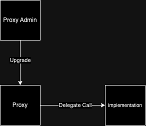
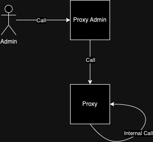
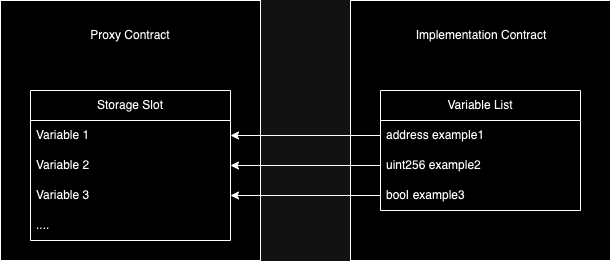
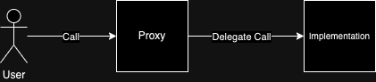
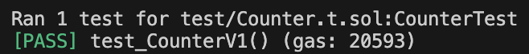
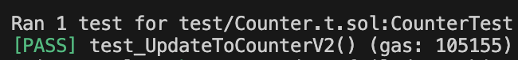
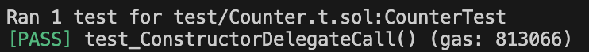

# Transparent Upgradeable Proxy

This article explain on upgrading smart contract easily by using `Transparent Upgradeable Proxy` utilizing [OpenZeppelin's library](https://github.com/OpenZeppelin/openzeppelin-contracts/tree/master/contracts/proxy/transparent).

This method allows logic in smart contract to be updated while keeping the data.

Even though there's other smart contract upgrade concept, `Transparent Upgradeable Proxy` is simpler to implement and widely use.

`Transparent Upgradeable Proxy` combines few different concepts assuming that the reader understand about delegate call, [function selector](https://www.rareskills.io/post/function-selector), [ERC-1967](https://www.rareskills.io/post/erc1967), and [clone pattern](https://www.rareskills.io/post/eip-1167-minimal-proxy-standard-with-initialization-clone-pattern).

### Proxy

Proxy is the main component of smart contract upgradeability. Proxy is a simple smart contract that delegates calls and data to an implementation contract which manages the logic. This concept allows users to interact with one contract address even if the implementation address is upgraded.

### Upgradeability

Smart contract is known for the immutability but with `Transparent Upgradeable Proxy` updating a smart contract is made possible. The upgradeability concept is not directly updating the smart contract but by creating a new one and using the existing data that is stored in the proxy contract.

## Concept

The concept of `Transparent Upgradeable Proxy` is to let users interact with smart contracts through a proxy which delegates the logic to the appointed address while the storage is kept in the proxy contract. Admin is allowed to change or update the existing logic by redirecting the logic address to the new one. Upgrade can be done through Proxy Admin contract which updates the implementation address on the Proxy contract.

`Transparent Upgradeable Proxy` itself consist of three main contract which consist of:

- Proxy contract
- Implementation contract
- Proxy Admin contract

The structure of those three contracts can be drawn like:



`Transparent Upgradeable Proxy` main feature is providing Proxy Admin contract which separate proxy contract function call and delegate call. Proxy contract separate internal calls and delegate calls by checking the msg.sender, which allows the proxy contract to have the same function name with the implementation and avoid function selector clashing. The Proxy Admin contract call can be described as:



Proxy contract will be the main contract which keeps all of the storage including the destination address for the implementation contract and access control (Proxy Admin Contract address). The use of `Transparent Upgradeable Proxy` itself can be shown through these two contract:

### Proxy Contract

Proxy contract code:


`constructor` with parameters that consist of `_logic`, `initialOwner`, and `_data`. Fill `_logic` parameter with implementation contract address, `initialOwner` with Proxy Admin contract address, and `_data` with encoded function call. `constructor` then manages the function call to the implementation address and keeps the admin address for implementation upgradeability purposes. `constructor` also initialize ERC1967 or the storage slot that used in proxy. Storage slot that initialized is kept in the proxy. State variables that are used in implementation contracts will refer to the proxy storage slot hence the order of the state variable is important or storage collision is inevitable.



`function _proxyAdmin()` returns the proxy admin address which allows the proxy admin to call the upgrade.

`function _fallback()` is the main function of a proxy contract. There's three features of `Transparent Upgradable Proxy` in this function which is:

- Permission Checking

First thing that the function does is to check who is the caller of the function. The function needs to check whether the contract caller is admin. This checking function usually consumes a lot of gas (2100 units) for the sload cost but this contract save the admin proxy address in immutable variable which will use less gas (6 unit).

- Restricting Proxy Admin Authority

If the caller is a proxy admin, the function then checks if msg.sig is equal with the internal upgrade function in this case `_dispatchUpgradeToAndCall` function. This step prevents the proxy admin to call another internal function that is not related with upgrading implementation contract.

- Delegate Call

The proxy contract delegate call from a user that is not admin to the implementation contract. This will allow the user to interact with the latest logic that is addressed by the proxy.

`function _dispatchUpgradeToAndCall` is called by the `_fallback()` function when the Proxy Admin intends to upgrade the contract along with the encoded function call onto the implementation contract.

User interaction flow can be described with:



### Proxy Admin Contract

Proxy Admin contract code:


`constructor` with `initialOwner`. This constructor will set the owner of the Proxy Admin and allow the admin to upgrade the proxy's implementation contract through this Proxy Admin contract.

`function upgradeAndCall()` with parameters that consist of `proxy`, `implementation`, `data`. Parameter `proxy` requires the intended Proxy contract address, `implementation` requires the new Implementation contract address, and `data` requires the encoded function call. This function then will call the proxy's `_dispatchUpgradeToAndCall` internal function to proceed with the upgrade.

Admin or the Proxy Admin contract owner able to upgrade the intended proxy logic with this contract. Upgrading through this Proxy Admin contract will allow the admin to interact with the proxy as a normal user without the risk of accidentally updating the implementation contract.

The flow of upgrading a implementation contract can be seen as:


## Smart Contract Upgrade Limitations

Although it is possible to update the logic of smart contracts by using `Transparent Upgradeable Proxy` there's some limitations on upgrading the implementation of smart contracts. Things that are need to mind before upgrading smart contracts are:

- Should not use `constructor` but use `initializer` modifier instead

An upgradeable contract cannot have a `constructor` in order to replace the functionality of constructor it is recommended to create a function with `initializer` modifier which allows the function to be called once.

- Handle `selfdestruct` and `delegatecall` with care

`selfdesctruct` and `delegatecall` are not recommended which can cause the contract to be unuseable. It is still possible to use both functions with extreme care by calling it through the proxy contract and not from the contract itself.

- Use the same storage layout

Storage layout is widely used across implementation versions to prevent collisions keeping the same storage layout is necessary when upgrading proxy logic. Storage layout can be kept by keeping the state variable name and order.

## Potential Pitfalls

There are some potential pitfalls on using `Transparent Upgradeable Proxy`:

### Storage Collision

Storage collision caused by change of storage layout which can make the data overwritten or corrupt. This could lead to loss of funds and make the contract not usable. Prevention could be done by making sure the storage layout is kept the same as the previous version by not changing or deleting any existing state variable, adding a new state variable must be done after declaration of state variable from the previous version.

### Unsecured Access Control

Proxy contract and Proxy Admin contract both have their own access control, incorrect access control could cause a proxy upgrade called by a malicious user. A correct access control must also be given to a correct Proxy Admin contract or the Proxy contract won't be able to invoke upgrade. This problem is already taken care of by the OpenZeppelin's library, it is recommended to not change the default template.

## Setting Up Transparent Upgradeable Proxy

### CounterV1.sol

Set up a simple logic contract, for this example simple counter contract.

```
// SPDX-License-Identifier: UNLICENSED
pragma solidity 0.8.20;

contract CounterV1 {
    address _proxyAdmin;
    uint256 public number;

    function increment() public {
        number++;
    }
}
```

### Proxy.sol

Proxy is the main contract, this code snippet will utilize OpenZeppelin's `Transparent Upgradeable Proxy` library. This contract will call the `Transparent Upgradeable Proxy` library which initializes a new proxy admin contract.

```
// SPDX-License-Identifier: Unlicensed
pragma solidity 0.8.20;

import {TransparentUpgradeableProxy} from "@openzeppelin/contracts/proxy/transparent/TransparentUpgradeableProxy.sol";

contract Proxy is TransparentUpgradeableProxy {
    address public proxyAdmin;

    constructor(address _logic, address _initialOwner, bytes memory _data)
        TransparentUpgradeableProxy(_logic, _initialOwner, _data)
    {
        proxyAdmin = _proxyAdmin();
    }
}
```

### Connecting Proxy and Implementation Contract

This example using foundry, the implementation contract and the proxy can be connected on deployment of the proxy contract.
`function setUp()` deploy CounterV1.sol contract and Proxy.sol contract with CounterV1 as arguments, for this example the admin is set to be the test contract itself. Since the proxy admin contract is initialized when deploying proxy contract, the address of the proxy admin can be gathered by `proxy.proxyAdmin()`;

```
// SPDX-License-Identifier: UNLICENSED
pragma solidity ^0.8.13;

import {Test, console} from "forge-std/Test.sol";
import {Proxy} from "../src/Proxy.sol";
import {CounterV1} from "../src/CounterV1.sol";
import {CounterV2} from "../src/CounterV2.sol";

import {ProxyAdmin} from "@openzeppelin/contracts/proxy/transparent/ProxyAdmin.sol";
import {ITransparentUpgradeableProxy} from "@openzeppelin/contracts/proxy/transparent/TransparentUpgradeableProxy.sol";

contract CounterTest is Test {
    ProxyAdmin proxyAdmin;
    Proxy proxy;
    CounterV1 counterV1;

    function setUp() public {
        counterV1 = new CounterV1();
        proxy = new Proxy(address(counterV1), address(this), "");
        proxyAdmin = ProxyAdmin(proxy.proxyAdmin());
    }

    ...
}
```

### Testing Proxy Contract with CounterV1 Logic

Every call of the logic contract has to use the address of the proxy. In this example is using CounterV1 as a type and using proxy as the address.

```
    ...

    function test_CounterV1() public {
        CounterV1 counter = CounterV1(address(proxy));
        uint256 initialNumber = counter.number();

        counter.increment();

        assertEq(initialNumber + 1, counter.number());
    }

    ...
```

As expected the increment increased the counter variable by one.



### Testing Proxy Contract with Upgrade to Counter V2 Logic

CounterV2 contract will update the increment function from adding value of one to value of two.

```
// SPDX-License-Identifier: UNLICENSED
pragma solidity 0.8.20;

contract CounterV2 {
    address _proxyAdmin;
    uint256 public number;

    function increment() public {
        number += 2;
    }
}
```

Upgrading a contract can be done by calling the `upgradeAndCall()` function through Proxy Admin contract. In this example proxy admin called proxy contract to update the implementation contract with the CounterV2 address.

```
    ...

    function test_UpdateToCounterV2() public {
        CounterV2 counterV2;
        counterV2 = new CounterV2();

        proxyAdmin.upgradeAndCall(ITransparentUpgradeableProxy(address(proxy)), address(counterV2), "");

        CounterV2 counter = CounterV2(address(proxy));
        uint256 initialNumber = counter.number();

        counter.increment();

        assertEq(initialNumber + 2, counter.number());
    }

    ...
```

New logic contract will be used instead of the old one. It can be seen that the `increment()` function will add a counter variable by two instead of one.



### \_data Parameter On Proxy Constructor

In two previous examples it focused on the concept of upgrading smart contract logic, the code snippet filled the `_data` arguments with an empty string which means no delegate call into the implementation contract at proxy deployment. This example will show delegate calls by utilizing the `_data` argument which is usually used as the replacement of constructor on the implementation contract. Here's a new Counter contract with a `function initializer`.

```
// SPDX-License-Identifier: UNLICENSED
pragma solidity 0.8.20;

import {Initializable} from "@openzeppelin/contracts/proxy/utils/Initializable.sol";

contract Counter is Initializable {
    address _proxyAdmin;
    uint256 public number;

    function initialize(uint256 _initialNumber) public initializer {
        number = _initialNumber;
    }

    function increment() public {
        number++;
    }
}
```

At proxy deployment let's assume the initial set up for the project is to have a number variable to have 10 as initial value. In order to do so `_data` argument in proxy constructor can be utilized.

```
    ...

    function test_ConstructorDelegateCall() public {
        Counter counter = new Counter();

        bytes memory data = abi.encodeWithSignature("initialize(uint256)", 10);

        Proxy newProxy = new Proxy(address(counter), address(this), data);

        assertEq(Counter(address(newProxy)).number(), 10);
    }

    ...
```

Passing the `_data` argument will result in a delegate call to the implementation contract at deployment. This deployment resulted in the initial value `number` set to 10 instead of the default value of 0.



## Tips on Upgrading Contract

OpenZeppelin not only provides the `Transparent Upgradeable Proxy` library but also provides tools that can help to check upgrade compatibility of the new implementation contract version. [OpenZeppelin Upgrades](https://github.com/OpenZeppelin/openzeppelin-upgrades) tools also help the flow of initializing and upgrading the upgradeable smart contract.

## Conclusion

`Transparent Upgradeable Proxy` allows developers to update the logic of smart contracts while keeping the existing data. This was possible due to proxy contracts that manage the storage management and separating the logic into a whole different contract. Storage management in upgradeable smart contracts must be handled with extra care but there are tools that can help to check eligibility of the new smart contract logic.
