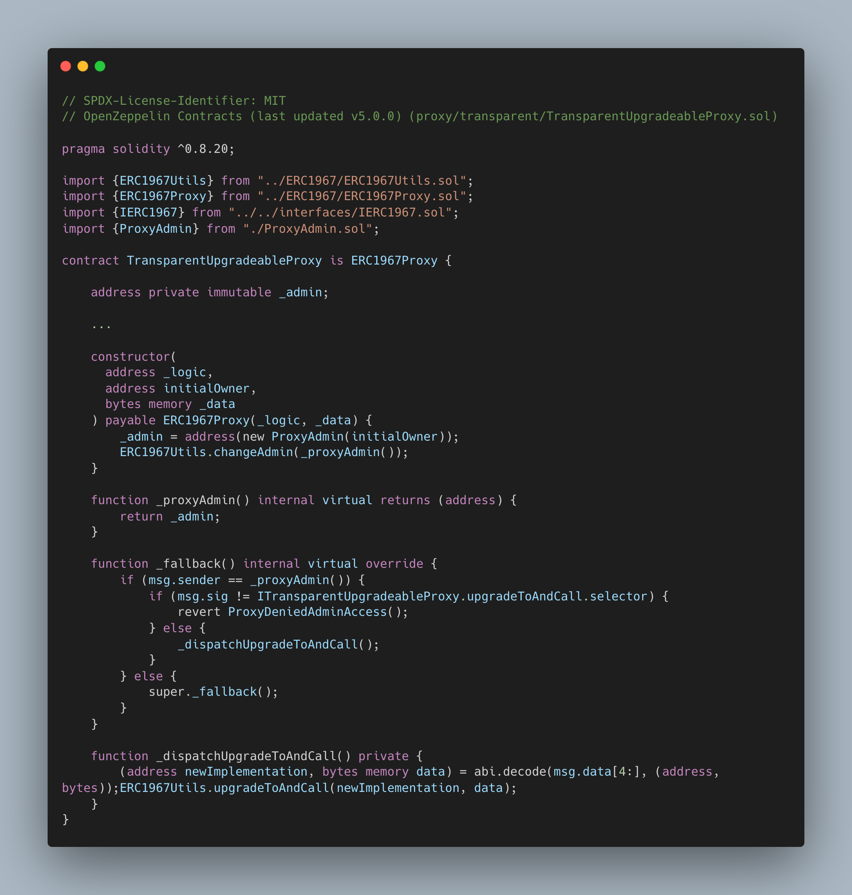

# Transparent Upgradeable Proxy

This article will be focused on how Transparent Upgradeable Proxy works by using the [OpenZeppelin's library](https://github.com/OpenZeppelin/openzeppelin-contracts/tree/master/contracts/proxy/transparent).

## Prerequisites

`Transparent Upgradeable Proxy` combines few different concepts, hence this article assumes that the reader understand about delegate call, [function selector](https://www.rareskills.io/post/function-selector), [ERC-1967](https://www.rareskills.io/post/erc1967), and [clone pattern](https://www.rareskills.io/post/eip-1167-minimal-proxy-standard-with-initialization-clone-pattern).

## Concept

The concept of `Transparent Upgradeable Proxy` is to let user interact with smart contract through a proxy which delegate the logic to the appointed address meanwhile the storage is kept in the proxy contract.

`Transparent Upgradeable Proxy` itself consist of three main contract which consist of:

- Proxy contract
- Implementatation contract
- Proxy Admin contract

The structure of those three contracts can be drawn like:

Proxy contract will be the main contract which keep all of the storage including the destination address for the implementation contract (implementation contract) and access control (Proxy Admin Contract address). The use of `Transparent Upgradeable Proxy` itself can be shown through these two contract:

### Proxy Contract

Proxy contract code:

`constructor` with parameters that consist of `_logic`, `initialOwner`, and `_data`. Fill `_logic` parameter with implementation contract address, `initialOwner` with Proxy Admin contract address, and `_data` with encoded function call. `constructor` then manage the function call to the implementation address and keep the admin address for implementation upgradeability purposes.

`function _proxyAdmin()` return the proxy admin address which allowed the proxy admin to call the upgrade.

`function _fallback()` manage delegate call to implementation contract and also manage the internal call for upgrading the smart contract logic. The fallback function only allow proxy admin to interact with `function _dispatchUpgradeToAndCall` or it will be reverted.

`function _dispatchUpgradeToAndCall` called by the `_fallback()` function when the Proxy Admin intend to upgrade the contract along with the encoded function call onto the implementation contract.

User interaction flow can be described with:

### Proxy Admin Contract

Proxy Admin contract code:

`constructor` with `initialOwner`. This constructor will set the owner of the Proxy Admin with allow the admin to upgrade the proxy's implement contract through this Proxy Admin contract.

`function upgradeAndCall()` with parameter that consist of `proxy`, `implementation`, `data`. Parameter `proxy` require intended Proxy contract address, `implementation` require the new Implementation contract address, and `data` require the encoded function call. This function then will call the proxy's `_dispatchUpgradeToAndCall` internal function to proceed with the upgrade.

Admin or the Proxy Admin contract owner able to upgrade the inteded proxy logic with this contract. Upgrading through this Proxy Admin contract will allow the admin to interact with the proxy as a normal user without the risk of accidently updating the implementation contract.

The flow of upgrading a implementation contract can be seen as:

## Implementation Contract Upgrade Notes

Although it is possible to update a logic of smart contract by using `Transparent Upgradeable Proxy` there's some limitation on upgrading the implementation smart contract. Things that are need to mind before upgrading smart contracts are:

- Should not use `constructor` but use `initializer` modifier instead

upgradeable contract cannot have a `constructor` in order to replace the functionality of constructor it is recommended to create a function with `initializer` modifier which allow the function to be called once.

- Handle `selfdestruct` and `delegatecall` with care

`selfdesctruct` and `delegatecall` is not recommended which can caused the contract to be unuseable. It is still possible to use both function with extreme care by calling it through the proxy contract and not from the contract itself.

- Use the same storage layout

Storage layout is widely use across implementation version to prevent collisions keeping the same storage layout is necessary when upgrading proxy logic. Storage layout can be kept by keeping the state variable name and order. Adding new state variable is possible but it must be done after initialization of existing state variable from the previous implementation version.

## Tips on Upgrading Contract

OpenZeppelin not only providing the `Transaparent Upgradeable Proxy` library but also provide tools that can help to check upgrade compatability of the new implementation contract version. [OpenZeppelin Upgrades](https://github.com/OpenZeppelin/openzeppelin-upgrades) tools also help the flow of initializing and upgrading the upgradeable smart contract.

## Conclusion

`Transparent Upgradeable Proxy` allow developer to update the logic of smart contract while keeping the existing data. This was possible due to proxy contract that manage the storage management and seperating the logic into a whole different contract. Storage management in upgradeable smart contract must be handled with extra care but there's a tools that can help to check eligibility of the new smart contract logic.
