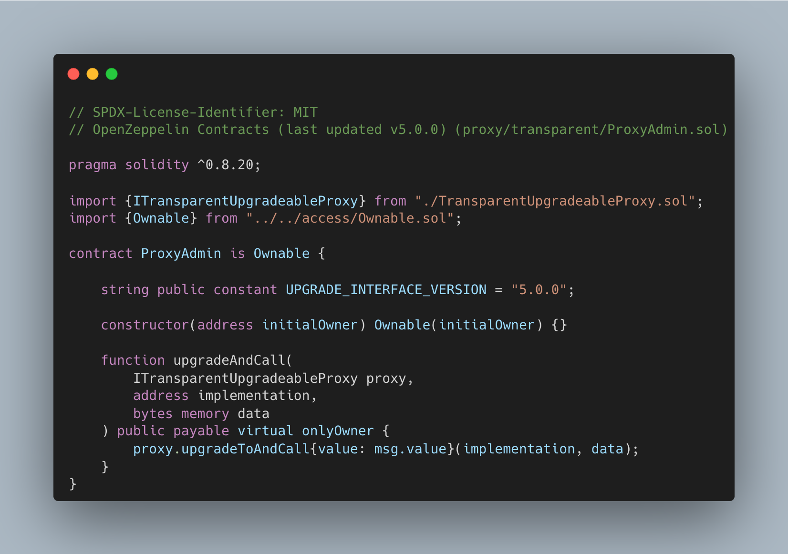
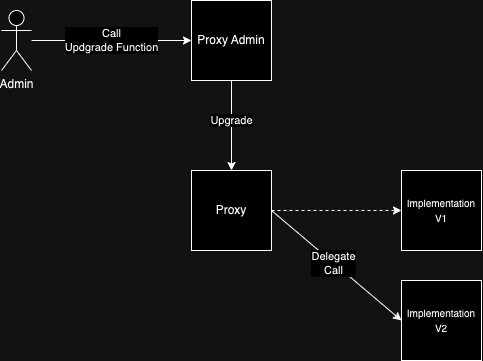

# Transparent Upgradeable Proxy

This article will be focused on how Transparent Upgradeable Proxy works by using the [OpenZeppelin's library](https://github.com/OpenZeppelin/openzeppelin-contracts/tree/master/contracts/proxy/transparent).

## Prerequisites

`Transparent Upgradeable Proxy` combines few different concepts, hence this article assumes that the reader understand about delegate call, [function selector](https://www.rareskills.io/post/function-selector), [ERC-1967](https://www.rareskills.io/post/erc1967), and [clone pattern](https://www.rareskills.io/post/eip-1167-minimal-proxy-standard-with-initialization-clone-pattern).

## Concept

The concept of `Transparent Upgradeable Proxy` is to let users interact with smart contracts through a proxy which delegates the logic to the appointed address while the storage is kept in the proxy contract. Admin is allowed to change or update the existing logic by redirecting the logic address to the new one. Upgrade can be done through Proxy Admin contract which updates the implementation address on the Proxy contract.

`Transparent Upgradeable Proxy` itself consist of three main contract which consist of:

- Proxy contract
- Implementation contract
- Proxy Admin contract

The structure of those three contracts can be drawn like:

Proxy contract will be the main contract which keeps all of the storage including the destination address for the implementation contract (implementation contract) and access control (Proxy Admin Contract address). The use of `Transparent Upgradeable Proxy` itself can be shown through these two contract:

### Proxy Contract

Proxy contract code:

`constructor` with parameters that consist of `_logic`, `initialOwner`, and `_data`. Fill `_logic` parameter with implementation contract address, `initialOwner` with Proxy Admin contract address, and `_data` with encoded function call. `constructor` then manages the function call to the implementation address and keeps the admin address for implementation upgradeability purposes.

`function _proxyAdmin()` returns the proxy admin address which allows the proxy admin to call the upgrade.

`function _fallback()` manages delegate calls to implementation contracts and also manages the internal calls for upgrading the smart contract logic. The fallback function only allows the proxy admin to interact with `function _dispatchUpgradeToAndCall` or it will be reverted.

`function _dispatchUpgradeToAndCall` is called by the `_fallback()` function when the Proxy Admin intends to upgrade the contract along with the encoded function call onto the implementation contract.

User interaction flow can be described with:

### Proxy Admin Contract

Proxy Admin contract code:

`constructor` with `initialOwner`. This constructor will set the owner of the Proxy Admin and allow the admin to upgrade the proxy's implementation contract through this Proxy Admin contract.

`function upgradeAndCall()` with parameters that consist of `proxy`, `implementation`, `data`. Parameter `proxy` requires the intended Proxy contract address, `implementation` requires the new Implementation contract address, and `data` requires the encoded function call. This function then will call the proxy's `_dispatchUpgradeToAndCall` internal function to proceed with the upgrade.

Admin or the Proxy Admin contract owner able to upgrade the intended proxy logic with this contract. Upgrading through this Proxy Admin contract will allow the admin to interact with the proxy as a normal user without the risk of accidentally updating the implementation contract.

The flow of upgrading a implementation contract can be seen as:

## Smart Contract Upgrade Limitations

Although it is possible to update the logic of smart contracts by using `Transparent Upgradeable Proxy` there's some limitations on upgrading the implementation of smart contracts. Things that are need to mind before upgrading smart contracts are:

- Should not use `constructor` but use `initializer` modifier instead

An upgradeable contract cannot have a `constructor` in order to replace the functionality of constructor it is recommended to create a function with `initializer` modifier which allow the function to be called once.

- Handle `selfdestruct` and `delegatecall` with care

`selfdesctruct` and `delegatecall` are not recommended which can cause the contract to be unuseable. It is still possible to use both functions with extreme care by calling it through the proxy contract and not from the contract itself.

- Use the same storage layout

Storage layout is widely used across implementation versions to prevent collisions keeping the same storage layout is necessary when upgrading proxy logic. Storage layout can be kept by keeping the state variable name and order. Adding a new state variable is possible but it must be done after initialization of the existing state variable from the previous implementation version.

## Tips on Upgrading Contract

OpenZeppelin not only provides the `Transaparent Upgradeable Proxy` library but also provides tools that can help to check upgrade compatability of the new implementation contract version. [OpenZeppelin Upgrades](https://github.com/OpenZeppelin/openzeppelin-upgrades) tools also help the flow of initializing and upgrading the upgradeable smart contract.

## Conclusion

`Transparent Upgradeable Proxy` allows developers to update the logic of smart contracts while keeping the existing data. This was possible due to proxy contracts that manage the storage management and separating the logic into a whole different contract. Storage management in upgradeable smart contracts must be handled with extra care but there are tools that can help to check eligibility of the new smart contract logic.
